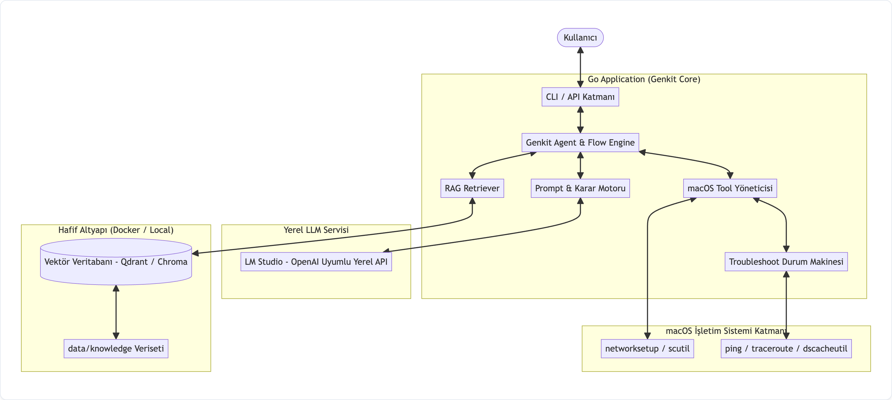
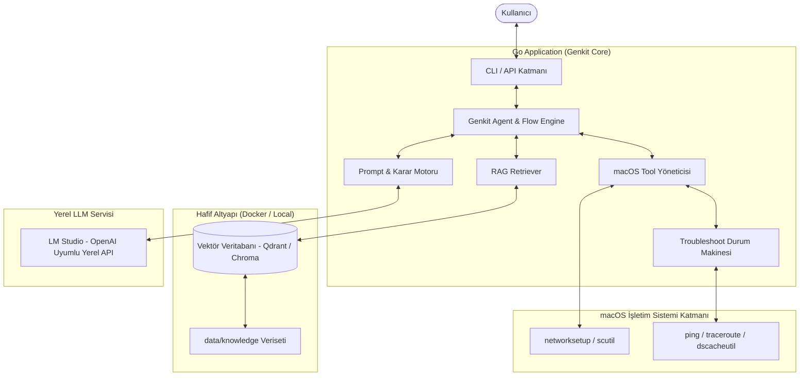

# macOS Ağ Asistanı: Agentic RAG Chatbot Mimari Gereksinim Dokümanı

Bu doküman, macOS işletim sistemi üzerinde çalışan, ağ yönetimi ve sorun giderme (troubleshooting) konularında uzmanlaşmış **Agentic RAG** mimarisine sahip chatbot projesinin teknik mimarisini, gereksinimlerini ve sistem tasarımını tanımlar.

---

## 1. Proje Özeti ve Vizyon

Proje; macOS kullanıcılarına ağ yönetimi, yapılandırma ve arıza tespiti konularında akıllı asistanlık yapan bir **Agentic RAG Chatbot** sistemidir. 

Sistem yalnızca statik bilgi döndürmekle kalmaz; kullanıcının niyetine göre:
1. **Bilgi Sağlama (Informational RAG):** Ağ ayarları ve protokoller hakkında dokümantasyona dayalı rehberlik sunar.
2. **Eylem Yürütme (Actionable Tool Calling):** Kullanıcının izni ve isteği doğrultusunda macOS üzerinde doğrudan ağ ayarlarını (DNS, DHCP, arayüz yönetimi vb.) yapılandırır.
3. **Otomatik Sorun Giderme (Troubleshooting Workflow):** Bağlantı sorunlarında adım adım teşhis (diagnostics) çalıştırır, elde edilen bulguları LLM ile analiz eder, düzeltici aksiyonlar dener ve çözüme ulaştırır.

Tüm sistem **Go** dili ve **Firebase Genkit (Go SDK)** ile geliştirilecek; model yerel olarak **LM Studio** üzerinden çalıştırılacak ve bağımlılıklar tek bir **Docker Compose** dosyasıyla ayağa kaldırılabilecek şekilde hafif tutulacaktır.

---

## 2. Sistem Mimarisi ve Veri Akışı

### 2.1 Mimari Diyagram





---

## 3. Temel Davranış Modelleri ve Senaryolar

Chatbot 3 temel senaryo üzerinde uzmanlaşmıştır:

### 3.1 Senaryo 1: Salt Bilgi Getirme (Informational RAG)
* **Kullanıcı Girişi:** *"DHCP ayarlarını nereden ve nasıl yapılandırabilirim?"*
* **İşlem Adımları:**
  1. Kullanıcı sorgusu vektörleştirilir ve RAG üzerinden ilgili doküman chunk'ları çekilir.
  2. Prompt şablonuna çekilen bilgi bağlam (context) olarak eklenir.
  3. LLM, kullanıcıya macOS arayüzünden veya terminalden DHCP ayarlarını nasıl yapacağını adım adım açıklar.
  4. Herhangi bir sistem tool'u çalıştırılmaz (yalnızca bilgilendirme).

### 3.2 Senaryo 2: Eylem Gerçekleştirme (Actionable Tool Execution)
* **Kullanıcı Girişi:** *"DNS adresimi 8.8.8.8 yap."*
* **İşlem Adımları:**
  1. Sorgu RAG'e gönderilir ve ilgili `dns-configuration` chunk'ı getirilir.
  2. **Çift Katmanlı Chunk Yapısı:** Chunk içeriğindeki 1. kısım kullanıcıya rehberlik bilgisi sunarken, 2. kısım model için tool kullanım kurallarını ve parametre şemasını içerir.
  3. LLM, kullanıcının aksiyon istediğini tespit eder ve Genkit `SetDNS` aracını (tool) tetikler.
  4. Tool, macOS üzerinde `networksetup -setdnsservers <interface> 8.8.8.8` komutunu güvenli biçimde yürütür.
  5. İşlem sonucu kullanıcıya teyit mesajı olarak iletilir.

### 3.3 Senaryo 3: Sorun Giderme ve Teşhis (Troubleshoot Workflow)
* **Kullanıcı Girişi:** *"İnternete erişemiyorum, bağlantım koptu."*
* **İşlem Adımları:**
  1. RAG üzerinden `ethernet-troubleshooting` / `wifi-troubleshooting` dokümanları çekilir.
  2. Model, `NetworkTroubleshootTool` aracını çağırır.
  3. **Teşhis Döngüsü:**
     - **Adım 1:** Ağ arayüzünün (Interface) durumu kontrol edilir (Up/Down).
     - **Adım 2:** Varsayılan ağ geçidine (Gateway) ping atılır.
     - **Adım 3:** Dış IP adresine (örn. `8.8.8.8`) ping atılır.
     - **Adım 4:** DNS çözümleme testi (örn. `google.com`) yapılır.
  4. **Akıllı Düzeltme & İterasyon:** 
     - Eğer gateway erişilebilir fakat DNS çözümlemesi başarısız ise, tool DNS önbelleğini temizler veya alternatif DNS (örn. Cloudflare 1.1.1.1 veya Google 8.8.8.8) atayarak testi yineler.
  5. **Analiz ve Raporlama:** Teşhis adımlarının sonuçları LLM'e bağlam olarak iletilir; LLM sorunun tam olarak nerede kaynaklandığını (Kablo, Gateway, ISP, DNS) ve yapılan/yapılması gereken işlemleri kullanıcıya net bir dille sunar.

---

## 4. Teknik Bileşenler ve Katman Mimarisi

### 4.1 Teknoloji Yığını (Tech Stack)
* **Programlama Dili:** Go (1.23+)
* **AI & Agent Çatısı:** Firebase Genkit (Go SDK)
* **Yerel LLM:** LM Studio (OpenAI-compatible API - `http://localhost:1234/v1`)
* **Vektör Veritabanı:** Qdrant (veya Chroma / SQLite-vec) — Tek bir Docker Compose ile yönetilebilir hafif yapı.
* **Embedding Modeli:** Yerel embedding modeli (LM Studio veya hafif yerel embedding servisi).
* **Hedef İşletim Sistemi:** macOS (Darwin ARM64 / AMD64).

### 4.2 Bileşen Sorumlulukları

```
staj-projesi/
├── cmd/
│   └── server/             # Uygulama giriş noktası (CLI / Web Runner)
├── internal/
│   ├── agent/              # Genkit Agent, Flow'lar ve Prompt orkestrasyonu
│   ├── config/             # LM Studio URL, Portlar, DB bağlantı ayarları
│   ├── rag/                # Vektör DB istemcisi, Retriever, Indexer ve Embedding
│   ├── tools/              # macOS sistem araçları (networksetup, ping, scutil wrapper)
│   └── models/             # Veri modelleri, DTO'lar, Tool input/output şemaları
├── data/
│   └── knowledge/          # RAG için çift katmanlı doküman veriseti (.json / .md)
├── deployments/
│   └── docker-compose.yml  # Vektör DB ve yardımcı servisler
├── docs/
│   ├── specs/              # Fonksiyonel ve teknik spesifikasyonlar
│   └── design/             # Detaylı tasarım dokümanları
└── chatbot-mimari.md       # Bu mimari gereksinim dokümanı
```

---

## 5. RAG Veriseti ve Çift Katmanlı Chunk Formatı Standardı

RAG verisetinde yer alan her doküman/chunk iki hedef kitleye hitap edecek biçimde tasarlanacaktır:

1. **İnsan / Kullanıcı Rehberliği (`user_guide`):** Kullanıcının okuyup anlayabileceği anlaşılır yönergeler, adımlar ve açıklamalar.
2. **Ajan / Model Yönergesi (`agent_spec`):** LLM'in hangi tool'u ne zaman seçeceğini, parametre kurallarını, komut kısıtlamalarını ve güvenlik kontrollerini belirten meta-bilgi.

### Standart Chunk JSON Şeması:

```json
{
  "id": "net-dns-001",
  "category": "dns_management",
  "title": "macOS DNS Yapılandırması ve Değiştirme",
  "page": 1,
  "user_guide": "macOS üzerinde DNS ayarları Sistem Ayarları > Ağ > İlgili Arayüz > Ayrıntılar > DNS sekmesinden veya terminal üzerinden networksetup komutu ile yapılır.",
  "agent_spec": {
    "supported_tools": ["SetDNSTool", "GetDNSTool"],
    "trigger_intents": ["change_dns", "set_dns", "update_dns", "view_dns"],
    "required_params": ["interface", "dns_servers"],
    "safety_level": "medium",
    "fallback_strategy": "troubleshoot_dns"
  },
  "raw_text": "Kapsamlı arama ve embedding için birleştirilmiş ve formatlanmış metin."
}
```

---

## 6. Güvenlik ve macOS İzin Yönetimi

* **Yetkilendirme:** macOS `networksetup` ve sistem ağ ayarlarını değiştiren komutlar yönetici (sudo/root) yetkisi veya kullanıcı onayı gerektirebilir. Tool katmanı, tehlikeli komutları izole edecek, girdi doğrulaması (input sanitization) yapacak ve komut enjeksiyonlarını (command injection) engelleyecektir.
* **Geri Alma (Rollback):** Kritik ağ ayarları (DNS vb.) değiştirilmeden önce mevcut yapılandırma yedeklenecek; başarısızlık durumunda otomatik geri alma sağlanacaktır.

---

## 7. Geliştirme Yol Haritası (Roadmap)

Proje aşağıdaki fazlar sırasıyla tamamlanarak geliştirilecektir:

1. **Faz 1: Mimari & Gereksinimler (Mevcut Aşama)** — `chatbot-mimari.md` dokümanının netleştirilmesi ve kullanıcı onayı.
2. **Faz 2: Veriseti Hazırlığı** — macOS ağ yönetimi ve troubleshooting senaryoları için çift katmanlı, sayfalanmış JSON/Markdown RAG verisetinin oluşturulması.
3. **Faz 3: Fonksiyonel Spesifikasyonlar (Specs)** — Modüllerin, API'lerin ve Genkit Tool kontratlarının (`docs/specs/`) hazırlanması.
4. **Faz 4: Detaylı Tasarım (Design)** — Go paket mimarisi, hata yönetimi ve Genkit Flow durum geçişlerinin (`docs/design/`) modellenmesi.
5. **Faz 5: Uygulama ve Entegrasyon (Implementation)** — Go kodlarının yazılması, LM Studio entegrasyonu, Docker Compose konfigürasyonu ve macOS tool'larının kodlanması.
6. **Faz 6: Test & Doğrulama (Verification)** — Senaryo testleri (Bilgi sorma, DNS değiştirme, Arıza giderme simülasyonları).
